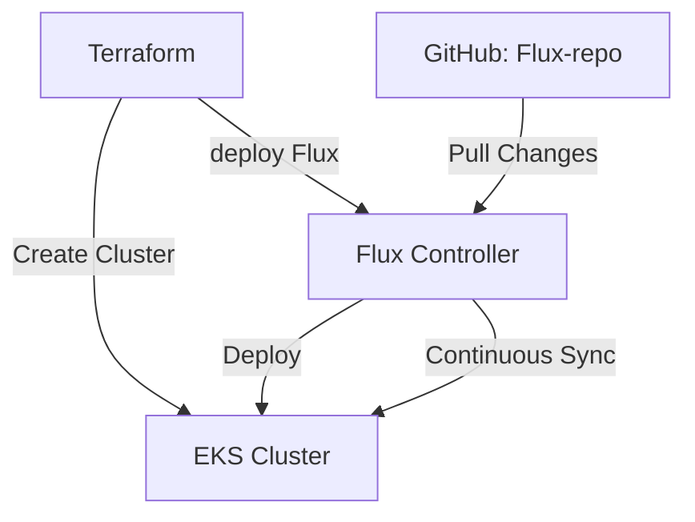

# AWS EKS Cluster Terraform Configuration

## Overview
This project provisions an Amazon EKS (Elastic Kubernetes Service) cluster using Terraform, including VPC, subnets, IAM roles, and node groups.

# ESS Cluster with Flux GitOps Implementation

## Architecture Diagram


## Project Overview
- ESS Cluster deployment using Terraform
- Flux GitOps controller integration
- Automated manifest deployment from GitHub

## Prerequisites
- AWS CLI configured
- Terraform installed
- Kubectl installed
- GitHub account with token
- Repository: https://github.com/gvamsi2010/Flux-test

## Infrastructure Components
### 1. AWS Resources
- ESS Cluster (eks-cluster-01)
- VPC with public subnets
- IAM roles and policies
- Security groups

### 2. Flux Components
- Flux controllers
- Source controller
- Kustomization controller
- Git repository sync

## Project Structure
├── provider.tf # AWS and Kubernetes provider configurations ├── eks-cluster.tf # EKS cluster and node group definitions └── vpc.tf # VPC, subnet, and networking resources
## Prerequisites
- AWS CLI installed and configured
- Terraform >= 1.0.0
- kubectl installed
- Valid AWS credentials

## Provider Versions
- AWS Provider: ~> 5.78.0
- Kubernetes Provider: Latest version

## Quick Start
1. Initialize Terraform:
```bash
terraform init

terraform plan

terraform apply

aws eks update-kubeconfig --region <your-region> --name eks-cluster-01


Infrastructure Components
EKS Cluster
VPC with public/private subnets
IAM roles and policies
Security groups
EKS node groups
Configuration Details
VPC Configuration
3 public subnets
Internet Gateway
Route tables
Auto-assign public IPs enabled
EKS Cluster
Kubernetes version: Latest
Public endpoint access
Node group configuration
IAM role associations
Security
Cluster security groups
IAM roles for cluster and nodes
RBAC configuration
Maintenance
To destroy the infrastructure:
terraform destroy

Troubleshooting
Common issues:

Subnet configuration errors
IAM permission issues
Security group conflicts
Contributing
Fork the repository
Create a feature branch
Submit a pull request
License
MIT License

Author
vamsi